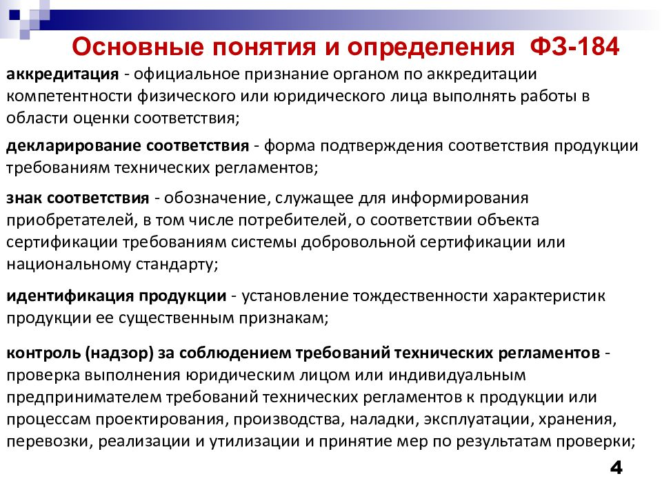
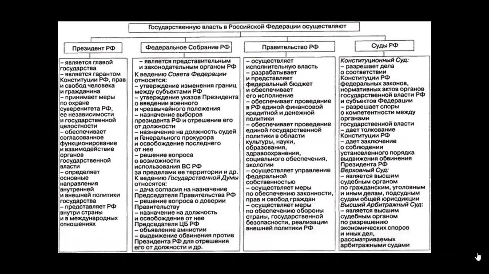
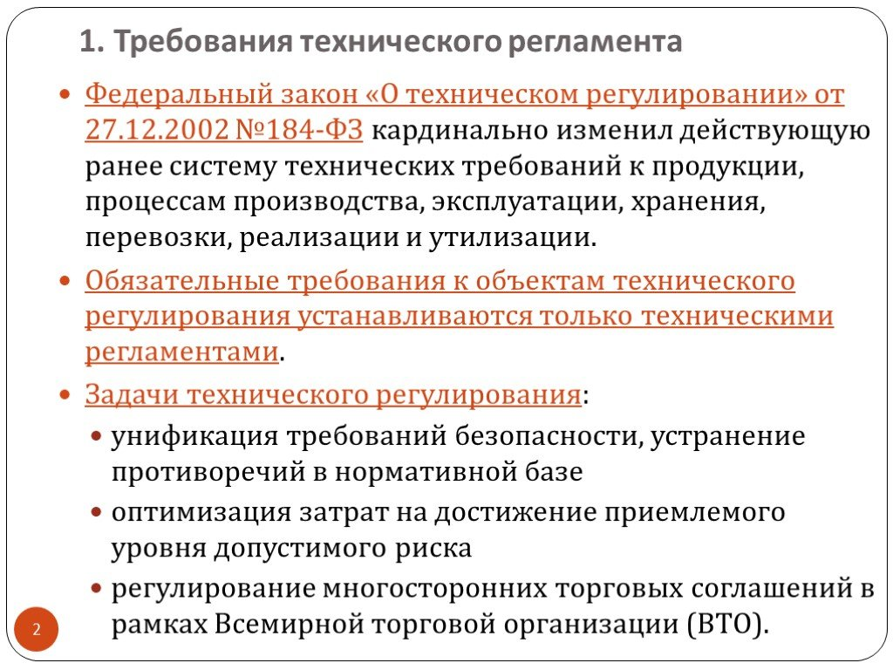
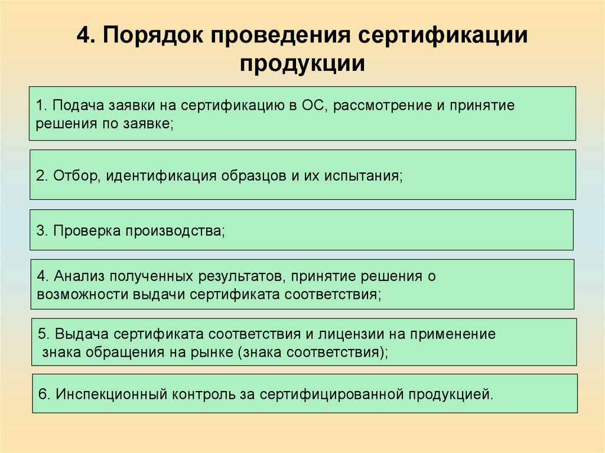

## Анализ Федерального закона №184

## Статья 1: Область действия закона

Статья 1 Федерального закона №184 определяет область его действия и регулируемых отношений.

**1. Разработка, принятие, применение и исполнение обязательных требований к продукции:** Закон регулирует процессы разработки и применения стандартов и требований к продукции. Это включает в себя проектирование, производство, строительство, эксплуатацию и другие этапы жизненного цикла продукции.

**2. Применение и исполнение на добровольной основе требований к продукции:** Закон также охватывает сферу добровольного применения требований к продукции и процессам, связанным с ней, для подтверждения их соответствия. Это означает, что производители и организации могут добровольно следовать стандартам и требованиям для улучшения качества продукции.

**3. Оценка соответствия:** Закон определяет процесс оценки соответствия продукции установленным требованиям. Это важный шаг для обеспечения того, что продукция соответствует стандартам и безопасности.

Статья 1 также устанавливает права и обязанности участников регулируемых отношений.

---
## Анализ ключевых понятий

1. **Безопасность продукции и связанных с ней процессов**
   
   Безопасность продукции и связанных с ней процессов (производства, эксплуатации, хранения, перевозки, реализации и утилизации) означает отсутствие недопустимого риска для жизни, здоровья людей, имущества, окружающей среды, а также для животных и растений. Это ключевое понятие для обеспечения высокого уровня безопасности и качества продукции на рынке.

2. **Ветеринарно-санитарные и фитосанитарные меры**

   Ветеринарно-санитарные и фитосанитарные меры - это обязательные требования и процедуры, направленные на защиту от рисков, связанных с распространением вредных организмов, заболеваний, переносчиков болезней, или болезнетворных организмов. Эти меры включают в себя контроль за животными, растениями, продукцией, грузами, материалами и другими элементами, чтобы предотвратить распространение вредных организмов и болезней.

3. **Декларирование соответствия**

   Декларирование соответствия - это процедура, при которой производитель или поставщик подтверждает соответствие своей продукции требованиям технических регламентов. Декларация о соответствии является документом, удостоверяющим это соответствие.

4. **Декларация о соответствии**

   Декларация о соответствии - это документ, удостоверяющий, что продукция соответствует требованиям технических регламентов. Она представляет собой один из инструментов для подтверждения соответствия продукции нормативным требованиям.

5. **Знак обращения на рынке**

   Знак обращения на рынке - это обозначение, которое информирует потребителей, включая конечных потребителей, о том, что продукция соответствует требованиям технических регламентов. Этот знак помогает потребителям принимать осознанные решения при покупке продукции.

6. **Знак соответствия**

   Знак соответствия - это обозначение, также информирующее потребителей о том, что объект сертификации соответствует требованиям системы добровольной сертификации. Это еще один способ доказательства соответствия продукции нормативным требованиям.

7. **Идентификация продукции**

     Идентификация продукции - это процесс установления тождественности характеристик продукции ее существенным признакам. 
8. **Международный стандарт** 
     Стандарт, принятый международной организацией. Это позволяет установить связь между национальными стандартами и мировыми стандартами.

9. **Недействительность декларации о соответствии и недействительность сертификата соответствия** 
     Эти понятия описывают основания для прекращения действия декларации о соответствии и сертификата соответствия, что может произойти в случае нарушений или изменений в продукции.

10. **Орган по сертификации** 
     Юридическое лицо или индивидуальный предприниматель, аккредитованный для выполнения работ по сертификации продукции.

11. **Оценка соответствия** 
     Процесс определения соответствия объекта требованиям, предъявляемым к нему.
12. **Подтверждение соответствия**
     Документальное удостоверение соответствия продукции или процессов требованиям технических регламентов или стандартам.

---
##Полнопмочия и органы управления

**Полномочия:**
 **Полномочия по оценке соответствия** 
 Закон устанавливает полномочия по оценке соответствия продукции и процессов требованиям технических регламентов. Это включает в себя сертификацию и декларирование соответствия. Органы по сертификации играют важную роль в этом процессе.

**Полномочия по аккредитации**
 Национальный орган по аккредитации аккредитует органы по сертификации, что дает им право проводить сертификацию продукции. Полномочия в области аккредитации исключительно важны для обеспечения надежности сертификации.

 **Полномочия по установлению и регулированию стандартов и требований**
  Закон также дает право устанавливать и регулировать стандарты и требования к продукции, что обеспечивает качество и безопасность продукции на рынке.

**Полномочия по обеспечению информирования потребителей**
 Закон требует использования знаков обращения на рынке и знаков соответствия для информирования потребителей о безопасности и соответствии продукции требованиям.

**Органы управления**

 **Органы по сертификации**
  Это юридические лица или индивидуальные предприниматели, аккредитованные для проведения работ по сертификации продукции. Они имеют полномочия по выдаче сертификатов соответствия.

**Национальный орган по аккредитации**
 Орган, отвечающий за аккредитацию органов по сертификации и обеспечение их компетентности. Национальный орган по аккредитации обеспечивает надежность системы сертификации.

**Органы государственного контроля и надзора**
 Эти органы могут прекращать действие деклараций о соответствии и сертификатов соответствия в случае выявления нарушений или изменений в продукции. Они обеспечивают соблюдение законодательства о техническом регулировании.

**Органы, отвечающие за установление стандартов и требовани**
 Эти органы могут устанавливать и регулировать стандарты и требования, которые должна соответствовать продукция.

Итак, Федеральный закон №184 устанавливает разделение полномочий между различными органами, включая органы по сертификации, национальный орган по аккредитации и органы государственного контроля и надзора. Это разделение полномочий помогает обеспечить качество, безопасность и соответствие продукции требованиям технического регулирования на рынке.

---
##Требования продукции
 **1.Требования к безопасности продукции и связанным с ней процессам**
  Одним из главных аспектов закона является обеспечение безопасности продукции и всех этапов ее жизненного цикла, включая проектирование, производство, эксплуатацию, хранение, перевозку, реализацию и утилизацию. Требования к безопасности продукции ориентированы на предотвращение рисков, связанных с потенциальным вредом для жизни и здоровья людей, окружающей среды, имущества и животных.

**2.Ветеринарно-санитарные и фитосанитарные меры**
 Закон устанавливает обязательные меры для защиты от рисков, связанных с распространением вредных организмов, болезней, и т.д., связанных с животными, растениями, продукцией и материалами. Это включает в себя меры для контроля за качеством и безопасностью продукции, а также для предотвращения распространения заболеваний и вредных организмов.

**3.Декларирование соответствия и сертификация**
 Закон предусматривает обязательные процедуры декларирования соответствия и сертификации продукции. Производители должны документально подтверждать соответствие своей продукции требованиям технических регламентов и стандартам. Это обеспечивает дополнительный уровень контроля над качеством продукции.

**4.Знаки обращения на рынке и знаки соответствия**
 Закон требует использования знаков обращения на рынке и знаков соответствия для информирования потребителей о безопасности и соответствии продукции требованиям. Эти знаки помогают потребителям принимать осознанные решения при выборе продукции.

**5.Идентификация продукции** 
Закон устанавливает процедуры для установления тождественности характеристик продукции ее существенным признакам. Это важно для обеспечения единых стандартов и качества продукции.

**6.Оценка и подтверждение соответствия**
 Закон устанавливает процедуры оценки соответствия и подтверждения соответствия продукции требованиям. Эти процедуры позволяют убедиться, что продукция соответствует установленным стандартам и требованиям.

Таким образом, Федеральный закон №184 устанавливает строгие требования к продукции, направленные на обеспечение ее безопасности, качества и соответствия нормативам. Закон также предусматривает механизмы декларирования и сертификации, а также использование информационных знаков для уведомления потребителей о продукции, которая соответствует требованиям технического регулирования. Эти меры способствуют обеспечению безопасности и качества продукции на рынке.

---
##Процедура сертификации
Процедура сертификации продукции в соответствии с Федеральным законом №184 "О техническом регулировании" включает в себя несколько ключевых шагов:

1. **Подготовка к сертификации:**
   - Производитель или заявитель подготавливает необходимые документы и информацию о продукции, включая техническую документацию, характеристики, результаты испытаний и иные документы, подтверждающие соответствие продукции требованиям технических регламентов.

2. **Выбор органа по сертификации:**
   - Заявитель выбирает орган по сертификации, который имеет аккредитацию и право проводить сертификацию продукции в соответствии с требованиями законодательства.

3. **Подача заявки:**
   - Заявитель подает заявку на сертификацию продукции в выбранный орган по сертификации. Заявка должна содержать необходимую информацию о продукции и требованиях, а также предоставление документов.

4. **Оценка продукции:**
   - Орган по сертификации проводит оценку продукции с использованием предоставленной документации и, при необходимости, проводит испытания продукции для проверки ее соответствия требованиям.

5. **Выдача сертификата соответствия:**
   - Если продукция соответствует требованиям технических регламентов и стандартов, орган по сертификации выдает сертификат соответствия. Сертификат является документом, удостоверяющим, что продукция соответствует установленным стандартам и требованиям.

6. **Мониторинг и контроль:**
   - После выдачи сертификата соответствия продукции, орган по сертификации может проводить мониторинг и контроль за качеством и безопасностью продукции на рынке. Это может включать в себя регулярные проверки и обновление сертификации.

7. **Регистрация в реестре:**
   - Сведения о выданных сертификатах соответствия регистрируются в реестре, что обеспечивает доступность информации для заинтересованных сторон и контролирующих органов.

8. **Срок действия сертификата и его продление:**
   - Сертификат соответствия имеет определенный срок действия. По истечении срока его действия, продукция должна быть повторно сертифицирована.

9. **Отзыв сертификата:**
   - Орган по сертификации может отозвать сертификат в случае выявления нарушений или изменений в продукции, которые могут повлиять на ее соответствие требованиям.

Процедура сертификации предусматривает обязательное подтверждение соответствия продукции установленным требованиям, что обеспечивает ее безопасность и качество на рынке. Органы по сертификации играют важную роль в этом процессе, обеспечивая надежность и независимость оценки продукции.

---
