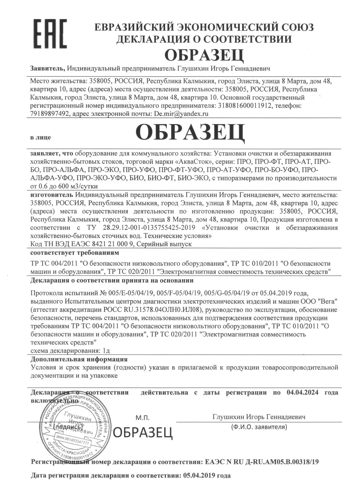
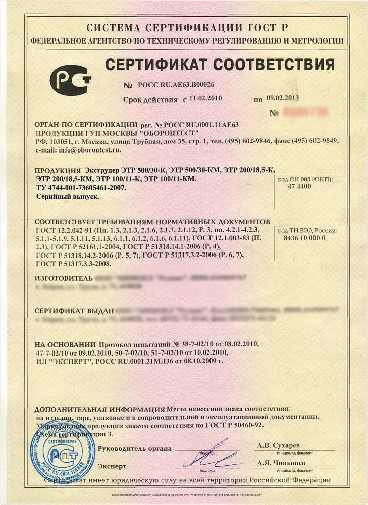
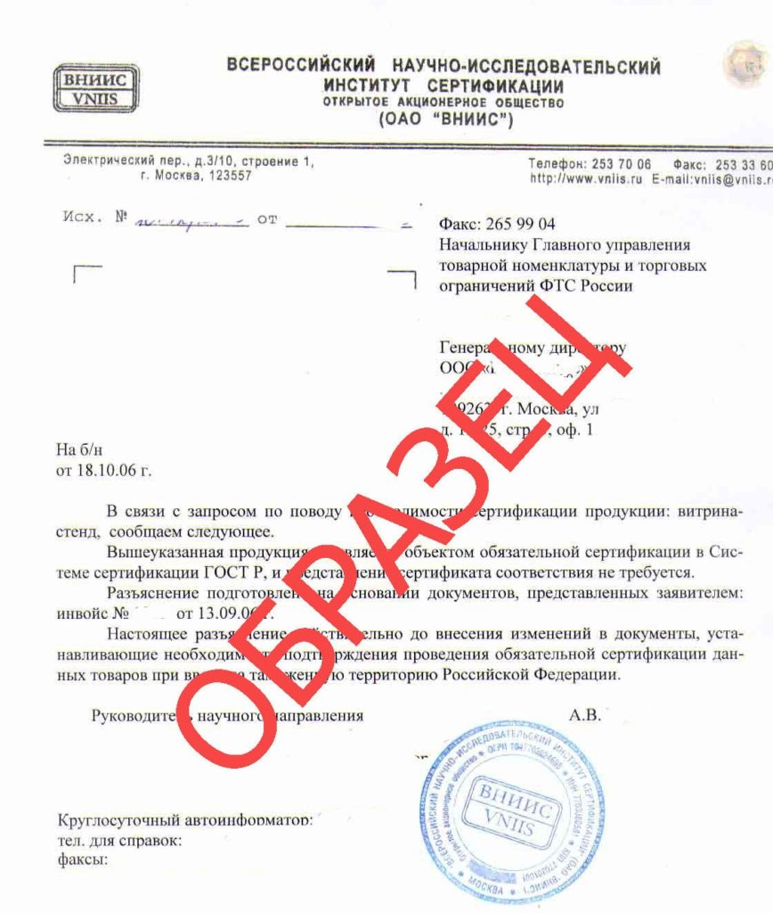

## Описать последовательность действий получения документов (Декларация о соответствии, сертификат соответствия и отказное письмо) с документов и статей.
# Декларация о соответствии

Документ описывает процедуры и правила, связанные с регистрацией, аннулированием, возобновлением и прекращением действия деклараций о соответствии, установленные Правительством Российской Федерации в постановлении от 19.06.2021 № 936. В соответствии с этими правилами:

- Декларации о соответствии продукции, включая требования технических регламентов Евразийского экономического союза (Таможенного союза), регистрируются в едином реестре сертификатов и деклараций о соответствии через специализированный сервис электронной регистрации.

- Регистрация выполняется лицами, зарегистрированными в России в качестве юридического лица или индивидуального предпринимателя, либо их уполномоченными представителями, а также аккредитованными органами по сертификации, учтенными в едином реестре органов по оценке соответствия Евразийского экономического союза и охватывающими сферу декларируемой продукции.

- Регистрация осуществляется с использованием усиленной квалифицированной электронной подписи заявителя или их уполномоченных представителей, а также с предоставлением соответствующих электронных документов и скан-копий в электронной форме.

- При соблюдении всех требований декларация о соответствии должна быть зарегистрирована в течение 3 рабочих дней с момента представления соответствующих сведений и документов.

- Регистрация, внесение данных и формирование информации в едином реестре подлежат контролю в соответствии с установленными правилами, законодательством России и законами Евразийского экономического союза с целью обеспечения качества государственных данных и сервисов.
# Сертификат соответствия

- Это барьер для защиты рынка от некачественной продукции. В каждой стране существуют стандарты, чтобы потребитель покупал вещи или продукты, которые не принесут вреда.

изложение основных моментов:

- Роль сертификации:
        Сертификация представляет собой важный барьер, предотвращающий появление на рынке продукции низкого качества и опасной для потребителей.
        В каждой стране существуют стандарты, и их соблюдение обязательно для предприятий, желающих предоставлять продукцию на рынок.

- Процесс сертификации:
        Процесс начинается с исследований, направленных на проверку безопасности материалов и компонентов продукции.
        Получение сертификата соответствия подразумевает, что продукция успешно прошла проверку и соответствует установленным стандартам.

- Пример процесса:
        Дается пример предпринимателя, запускающего производство детских игрушек. В этом контексте подчеркивается, что сертификация является неотъемлемой частью этапа выпуска продукции на рынок.

- Перечень товаров, подлежащих сертификации:
        Указывается перечень товаров, для которых обязательна сертификация, включая детские игрушки, музыкальные инструменты, нижнее белье, оружие и автомобили.

- Различия между сертификатами и декларациями соответствия:
        Текст подчеркивает важность понимания различий между сертификатами и декларациями соответствия, которые несут разную степень ответственности за качество продукции.

- Типы сертификатов соответствия:
        Вводится понятие двух основных типов сертификатов, таких как ГОСТ Р и ТР ТС, и указывается их значение для различных рынков.

- Дополнительные виды сертификатов:
        Описываются другие виды сертификатов, такие как сертификаты пожарной безопасности или ISO, которые могут быть необходимы в зависимости от характера продукции и регулирований.

- Процесс получения сертификата:
        Описывается процесс получения сертификата, начиная от написания заявления до проверки продукции и, в случае соответствия, выдачи зарегистрированного сертификата.
# Что такое отказное письмо

- Отказное письмо – это документ, информирующий о том, что   конкретный товар не требует прохождения процедуры сертификации.
    Существуют два вида отказных писем: для торговли и для таможенного оформления. В данном контексте рассматривается вариант для продажи товаров на маркетплейсах.

Характеристики:

- Отказное письмо оформляется на конкретное юридическое лицо или индивидуального предпринимателя (ИП).
    Для самозанятых лиц существуют некоторые нюансы в силу законодательных особенностей.

Оформление для самозанятых:

- Оформление отказного письма для самозанятых с точки зрения закона может быть некорректным, так как самозанятые фактически не являются юридическими лицами. Однако фактически такие письма могут помочь самозанятым в ряде ситуаций, укажут ФИО и адрес получателя без упоминания ОГРНИП.

Основные пункты в отказном письме:

- Не попадает под Постановление Правительства № 2425:
        Продукция не подпадает под установленные Правительством требования, включая все изменения и дополнения.

- Не попадает под Технический регламент:
        Отмечается, что продукция не требует сертификации согласно не только ГОСТ, но и Техническому регламенту Таможенного союза.
- Категории товаров, подлежащих декларированию по ТР ТС:
        Уточняется, что определенные категории товаров, хотя и не требуют сертификации по ГОСТ, должны быть декларированы согласно Техническому регламенту Таможенного союза. Приводится пример – бальзам для губ.
- Постановление № 620:
        Отмечается, что продукция не подпадает под Постановление № 620, которое связано с Постановлением Правительства № 2425 (бывшим № 982). Возможно, возможно сделать единую декларацию, действительную для товара во всех странах Таможенного союза, даже если нет активных технических регламентов.

- Коды ТН ВЭД и ОКПД2:
        Заостряется внимание на кодах товаров, включая ТН ВЭД и ОКПД2, хотя последнее время отмечается тенденция ухода от обязательного включения кодов ОКПД2 в письма из-за их удаления из перечня в Постановлении Правительства № 2425.

Выбор источника:

    В заключении упоминается о том, что можно получить отказное письмо от аккредитованных органов по сертификации (например, Ростест, ВНИИ сертификации), , добровольных органов по сертификации или обычных организаций.
    
# Рассмотреть четыре ситуации, когда делается декларация о соответствии, сертификат соответствия, отказное письмо и декларация о соответствии и сертификат соответствия одновременно.
- Декларация о соответствии:
        Ситуация: Производитель вводит на рынок новую линейку бытовой химии, такой как моющие средства.
        Почему декларация о соответствии: В соответствии с законодательством, бытовая химия может подлежать декларированию, и производитель может самостоятельно заявить о соответствии своей продукции установленным стандартам и требованиям без прохождения процедуры сертификации.

- Сертификат соответствия:
        Ситуация: Автомобильный завод начинает выпуск новой модели автомобилей.
        Почему сертификат соответствия: Автомобиль относится к товарам, для которых требуется процедура обязательной сертификации. Производитель обращается в аккредитованный центр сертификации для проверки соответствия продукции техническим стандартам и получения сертификата.

- Отказное письмо:
        Ситуация: Малый производитель выпускает редкую продукцию, которая не попадает под обязательные требования сертификации или декларирования.
        Почему отказное письмо: Производитель решает, что его продукция не подлежит сертификации или декларированию, и обращается к органу по сертификации с запросом на выдачу отказного письма, подтверждающего, что его товар не требует сертификации.

- Декларация о соответствии и сертификат соответствия одновременно:
        Ситуация: Производитель электроники выпускает новый вид электронных устройств, например, смартфоны.
        Почему декларация и сертификат соответствия одновременно: Для ускорения процесса введения продукции на рынок и повышения доверия потребителей, производитель решает провести и сертификацию, и декларацию о соответствии. Сертификация может быть обязательна для этой категории товаров, а декларация дает дополнительное подтверждение соответствия стандартам.